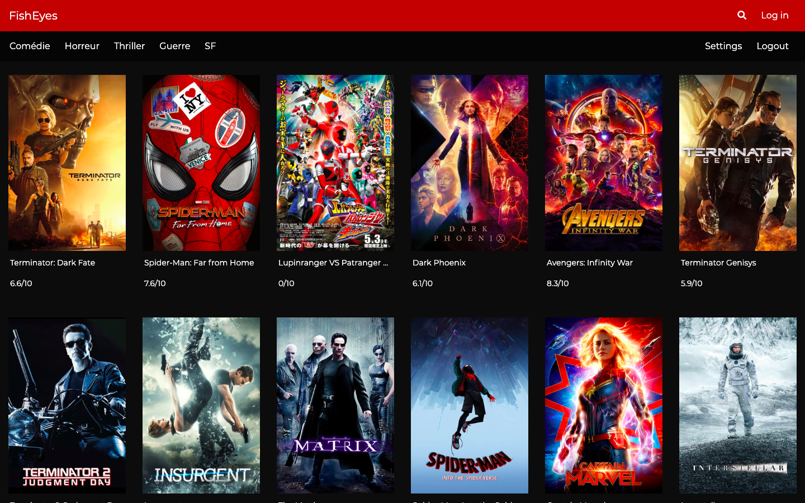

# Projet FishEyes

Projet inspiré de Netflix, Amazon Prime Video. Le but est d'afficher le catalogue de film par genre et de pouvoir mettre un commentaire sur le film choisi. L'utilisateur doit s'inscrire comme membre pour pouvoir faire un commentaire. Après avoir choisi le film, une fenêtre est affichée présentant l'affiche, le score, et permet d'accéder aux commentaires si l'utilisateur est membre.

[Démo - Site](https://fisheyes-getflix.000webhostapp.com/)
[Démo - Gestion de la base de données](https://fisheyes-getflix.000webhostapp.com/database)

### Langages et outils utilisés

* Frontend - HTML, CSS, Javascript
* Backend - PHP, MySQL
* API - MovieDB
* Framework - Bootstrap

### Description de la base de données

**Nom de la base : id11453176_fisheyes**

####user

| Field        | Type           | Null  | Key   |Default|Extra  |
| -------------|:--------------:|:-----:|:------:|:------:|:------:|
| ID           | INT(11)        |   NO  | PRI   | NULL  |AUTO_INCREMENT  |
| Username     | VARCAR(255)    |   NO  |       | NULL  |       |
| Email        | VARCAR(255)    |   NO  |       | NULL  |       |
| Password     | VARCAR(255)    |   NO  |       | NULL  |       |

####commentaire

| Field                | Type           | Null  | Key   |Default|Extra  |
| ---------------------|:--------------:|:-----:|:------:|:------:|:------:|
| ID                     | INT(11)        |   NO  | PRI   | NULL  |AUTO_INCREMENT  |
| ID_users               | VARCAR(255)    |   NO  |       | NULL  |       |
| ID_movies              | VARCAR(255)    |   NO  |       | NULL  |       |
| Comment                | VARCAR(255)    |   NO  |       | NULL  |       |
| Date_commentaire     | DATETIME()    |   NO  |       | CURRENT_TIMESTAMP()  |       |

### Auteurs

* **Achraf Atauil** 
* **Peter Van Wymeersch**
* **Soufiane El Ghorfi**
* **Shao Yuan  Weng**
Becode BXL_Lovelace_4.14

### Date de création - version 
* 11/2019 - version 1

